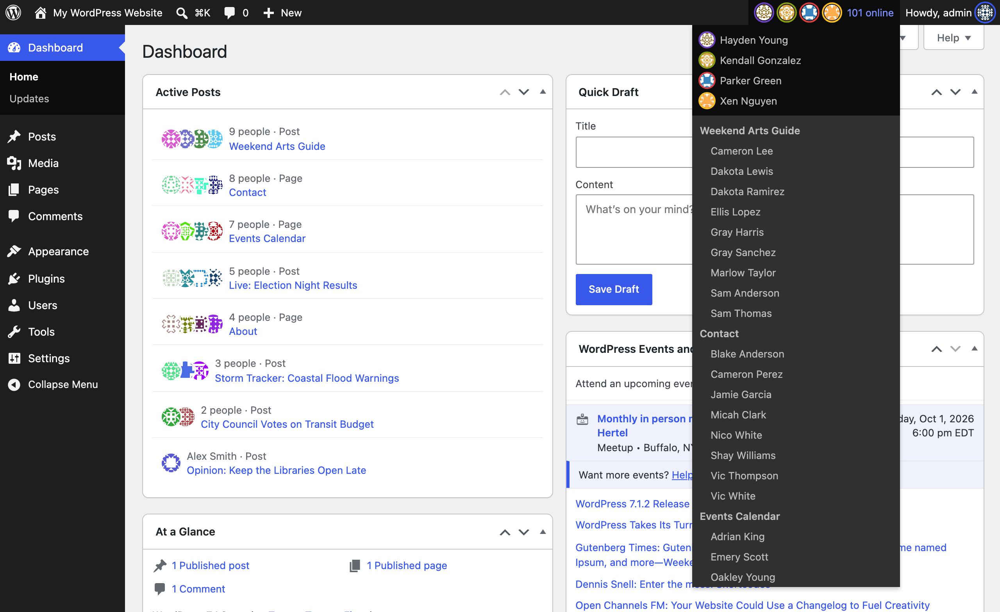
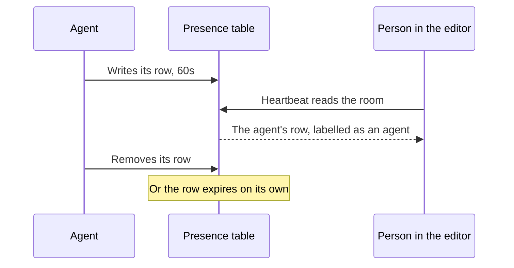

# Presence API

[](https://github.com/WordPress/presence-api/actions/workflows/ci.yml)

A feature plugin for system-wide presence and awareness in WordPress.

> [!IMPORTANT]
> **Built for the lowest common denominator of environments.** No object cache, no WebSockets, no extra services: a dedicated table with a TTL is the only moving part. Anything a managed host offers on top is a bonus, never a dependency.

## Problem

WordPress has no way to know who is logged in, what screen they are on, or which posts are being edited, without writing to shared tables like `wp_postmeta` or `wp_options`. High-frequency writes to those tables invalidate caches site-wide ([#64696](https://core.trac.wordpress.org/ticket/64696)). This plugin uses a dedicated `wp_presence` table with a 150-second TTL to provide that awareness with zero cache side effects.

> "This idea of presence I think is really cool and seeing where people are... you log into your WordPress, I see oh Matias is moderating some comments, Lynn is on the dashboard maybe reading some news... that idea of like you log in and you can kind of see the neighborhood of like who else is also there."
>
> [Matt Mullenweg, WordPress 7.0 planning session](https://youtu.be/F-xMPY9WqG4?si=YK0rIUM2nuYy7x45&t=2435)



## Run locally

```bash
npm install
npx wp-env start
```

Then open [localhost:8888/wp-admin/](http://localhost:8888/wp-admin/) (admin / password).

## WordPress Playground

No install needed — launch a scratch site straight from `main`.

|  | 25 users | 100 users |
| --- | --- | --- |
| **Single site** | [](https://playground.wordpress.net/?blueprint-url=https://raw.githubusercontent.com/WordPress/presence-api/main/blueprint.json) | [](https://playground.wordpress.net/?blueprint-url=https://raw.githubusercontent.com/WordPress/presence-api/main/blueprint-100.json) |
| **Multisite** | [](https://playground.wordpress.net/?blueprint-url=https://raw.githubusercontent.com/WordPress/presence-api/main/blueprint-multisite.json) | [](https://playground.wordpress.net/?blueprint-url=https://raw.githubusercontent.com/WordPress/presence-api/main/blueprint-multisite-100.json) |

## Data flow

1. Browser sends `presence-ping` via Heartbeat
2. Server upserts into `wp_presence`
3. Server answers with the admin bar node's markup, the Active Posts list, and a hash of the `admin/online` room
4. The admin bar swaps its node when the markup changes, unless its menu is open, and Active Posts redraws when its posts change
5. After a run of ticks with an unchanged hash, the ping widens the Heartbeat interval; a new hash snaps it back

Only Heartbeat refreshes a row between page loads. With its script removed, or its interval above the TTL less 15 seconds (135 by default), someone who stays on one screen drops out of the room while still there. Site Health reports both.

## Rooms

| Pattern                | Example            |
| ---------------------- | ------------------ |
| `admin/online`         | All admin pages    |
| `postType/{type}:{id}` | `postType/post:42` |

Every post type edited in the admin gets a room; see [Post Type Support](#post-type-support).

### Client IDs

Rooms carry no producer namespace of their own — this plugin's own writers are told apart from anyone else's entries in the same room by a `client_id` prefix instead. `user-{user_id}` (admin/online room, from `plugins/presence-api/includes/heartbeat.php` and `includes/lifecycle.php`), `editor-{user_id}` (post rooms, from `plugins/presence-api/includes/heartbeat.php` and `includes/post-lock-bridge.php`) and `cli-{user_id}` (any room, from `includes/cli/class-wp-presence-cli-command.php`, the default when `wp presence set` is given no client ID) are reserved this way; a row using any of them belongs to this plugin and has the state shape its writer expects.

Anything else sharing a room — another plugin relaying awareness from an external source, a REST client — must prefix its own `client_id` so it can't collide with those rows or be mistaken for one. A plugin that backs the block editor's awareness with this table takes a prefix of its own, like `gse-` for [gutenberg-sync-engines](https://github.com/Automattic/gutenberg-sync-engines). Pass that prefix as the third argument to `wp_get_presence()` to read back only your own rows: `wp_get_presence( $room, $timeout, 'gse-' )`.

A leading `_` is reserved for this plugin's own bookkeeping rows, which are not participants. `_collab` holds a post room's last observed editor count, the state the collaboration actions below fire their edges from. `_lock` holds the post's `_edit_lock`. `wp_get_presence()` and the REST collection leave those rows out, and the REST write and delete routes reject a reserved `client_id`.

The `editor-` prefix is load-bearing rather than cosmetic: `plugins/presence-api/includes/heartbeat.php` counts the editors in a post room with `str_starts_with( $entry->client_id, 'editor-' )`, so a colliding prefix inflates that count.

## Agents

An AI agent editing WordPress over REST or MCP runs no Heartbeat, so it never picks up an `admin/online` row on its own and, without more, is invisible to a person watching the same post. It does not need one: it writes its own row in the post room it is editing, with its own expiry, and that is enough for Who's Online, the admin bar and the post list's Editors column to show it, labelled, alongside everyone else.

```php
// Join: write a row that expires in 60 seconds if nothing renews it.
wp_set_presence( 'postType/post:42', 'agent-' . $user_id, array(), $user_id, null, 60 );

// While still working, write again before the window runs out, to stay
// present. A single long $expires_in is not the way — see below.
wp_set_presence( 'postType/post:42', 'agent-' . $user_id, array(), $user_id, null, 60 );

// Leave, once done. Otherwise the row simply expires on its own.
wp_remove_presence( 'postType/post:42', 'agent-' . $user_id );
```



Write a short row again rather than one long `$expires_in`: `wp_presence_is_idle()`'s reader-facing threshold is `wp_presence_max_staleness() + ` the Heartbeat interval — well under an hour — so a row left untouched for the whole of a long window reads as idle long before it expires. `$expires_in` is capped by the [`wp_presence_max_expires_in`](#wp_presence_max_expires_in) filter (default one hour) regardless.

An agent's `client_id` needs no reserved prefix of its own; `agent-{user_id}` is a convention, not a requirement enforced anywhere. What does matter is `$user_id`: a row with no `user_id`, or one belonging to a person, is never labelled.

Who counts as an agent is not this plugin's call — that belongs to whichever plugin marks the `WP_User`, such as [Agent Users](https://github.com/WordPress/ai/pull/961). `wp_presence_is_agent_user( $user_id )` is a plain filter, `false` by default, so a site with no such plugin never labels anyone as an agent:

```php
add_filter( 'wp_presence_is_agent_user', function ( $is_agent, $user_id ) {
    return function_exists( 'wpai_is_agent_user' ) ? wpai_is_agent_user( $user_id ) : $is_agent;
}, 10, 2 );
```

This plugin already registers that exact filter, so nothing further is needed once `wpai_is_agent_user()` is loaded.

An agent is labelled wherever a presence row is listed by user — Who's Online, the admin bar and the post list's Editors column — but is not counted by [`wp_presence_collaboration_started`](#wp_presence_collaboration_started): that action watches `editor-` rows specifically, and an agent's row does not use that prefix.

## PHP API

<details>
<summary>Functions, return shapes, and network variants</summary>

The following public functions are part of the stable public API contract. All other helper functions in `plugins/presence-api/includes/presence.php` and `plugins/presence-api/includes/network-functions.php` (such as `wp_get_active_rooms()`, `wp_get_presence_summary()`, etc.) are marked `@access private`, are intended for internal plugin use only, and may change or be removed without notice.

```php
// Read all presence entries in a room, or only those whose client_id starts
// with $client_prefix. The prefix is matched literally, in the query.
// A $timeout you pass is the window used; null takes the site's filtered TTL.
$entries = wp_get_presence( $room, $timeout = null, $client_prefix = '' );

// Upsert a client's presence state. Atomic via INSERT … ON DUPLICATE KEY UPDATE.
// $date_gmt ('Y-m-d H:i:s') lets a caller relaying awareness on behalf of
// other clients preserve their timestamps instead of stamping every relayed
// row with its own clock; a value in the future is clamped to now, and a
// value that isn't a real calendar date is rejected (returns false). Passing
// it also skips the internal check that otherwise leaves an unchanged row
// untouched, since a relay backdating a departed collaborator needs that
// write to land. Defaults to now.
// $expires_in (seconds, relative to $date_gmt) is how long the row counts as
// present, for a writer that knows when its clients leave and removes their
// rows itself: the window is then the backstop for a departure that never
// arrived, not the interval it has to keep re-stamping inside. Capped by the
// wp_presence_max_expires_in filter (default one hour); below one second is
// rejected (returns false). Passing it also skips the unchanged-row check, so
// the extension always lands. Defaults to the site TTL.
wp_set_presence( $room, $client_id, $state, $user_id = 0, $date_gmt = null, $expires_in = null );

// Remove a single client from a room.
wp_remove_presence( $room, $client_id );

// Write, or remove, a client and read the room back in one call, for a
// caller that re-reads after every write. The read is scoped by
// $client_prefix, as in wp_get_presence().
$entries = wp_presence_exchange( $room, $client_id, $state, $user_id = 0, $timeout = null, $client_prefix = '' );
$entries = wp_presence_leave( $room, $client_id, $timeout = null, $client_prefix = '' );

// Remove all presence entries for a user across all rooms.
wp_remove_user_presence( $user_id );

// Check whether a user can access a room (edit_post for a post's room, otherwise any post type).
wp_can_access_presence_room( $room, $user_id = 0 );

// Return the canonical room string for a post, or false if the post type
// does not support presence.
$room = wp_presence_post_room( $post );

// Whether this site records presence at all.
wp_presence_recording_enabled();

// Whether presence can be used here: the table exists and recording is on.
wp_presence_is_available();
```

If you build on this plugin, check `wp_presence_is_available()` before you depend on it. The `function_exists()` guard covers the plugin not being loaded:

```php
if ( function_exists( 'wp_presence_is_available' ) && wp_presence_is_available() ) {
	// Read and write presence.
}
```

Without that check, a site with no table or with recording off still accepts your calls: `wp_set_presence()` returns `false`, and `wp_get_presence()` returns an empty array that reads the same as an empty room.

Each entry object returned by `wp_get_presence()` has:

| Field       | Type     | Notes                                                                                                                      |
| ----------- | -------- | --------------------------------------------------------------------------------------------------------------------------- |
| `room`      | `string` | The room the entry belongs to.                                                                                              |
| `client_id` | `string` | A `varchar` column — opaque, and not guaranteed numeric even when it looks like one. See [Client IDs](#client-ids).         |
| `user_id`   | `string` | `"0"` for an entry with no signed-in user. Every column comes back as a string, so cast before a strict comparison. |
| `data`      | `array`  | Decoded from the stored JSON; an empty array if that JSON failed to decode.                                                 |
| `date_gmt`  | `string` | A MySQL `datetime` string in UTC (e.g. `2024-01-01 12:00:00`), not a Unix timestamp. Convert with `strtotime( $entry->date_gmt . ' UTC' )`. See below for how far behind a live client it can sit. |

`date_gmt` is not rewritten on every ping. An unchanged row is left alone until it is 30 seconds old, however high the TTL goes, and that is on top of the gap the client leaves between pings, so both have to fit inside any liveness window you read off `date_gmt` yourself. Entries from `wp_get_presence()` are already filtered on each row's own expiry, so the window only matters if you are working out a tighter one yourself. Passing an explicit `$date_gmt` to `wp_set_presence()` writes every time.

### Network

Multisite only, from `plugins/presence-api/includes/network-functions.php`. Returns `false` outside multisite.

```php
// Whether this network assembles its sites' rows into the network-wide view.
wp_presence_network_aggregation_enabled();
```

</details>

## Extension Points

### Post Type Support
The plugin adds `presence` support to templates, template parts, and every post type with `show_ui` and `editor` support, including ones registered after it loads. To leave one out, remove support once it is registered:
```php
add_action( 'init', function () {
    remove_post_type_support( 'my-post-type', 'presence' );
}, 11 );
```

Without support, `wp_presence_post_room()` returns `false` for that post type and no per-post room is created. Its post locks still move out of post meta.

<details>
<summary>Filters and actions</summary>

### Filters
#### `wp_presence_default_ttl`
Filters the presence TTL (time-to-live) in seconds, used when nobody names a window of their own: the expiry a row is written with, and the window a read treats as present. Default: 150. Changing it does not re-age rows already stored; anyone still present picks up the new expiry on their next ping.

Values under 120 drop a tab that is still open and still pinging, since that is the Heartbeat interval core gives an unfocused or five-minute-idle tab.

A caller that passes its own `$timeout` gets that window on every site, so this filter leaves it alone. Something asking `wp_get_presence( $room, 30 )` has decided what counts as live for its own feature, and a site widening that would let it read stale clients as present.
```php
add_filter( 'wp_presence_default_ttl', function( $timeout ) {
    return 300; // Override TTL to 5 minutes.
} );
```

Or define the constant before the plugin loads:
```php
define( 'WP_PRESENCE_DEFAULT_TTL', 300 );
```

#### `wp_presence_max_expires_in`
Filters the longest window, in seconds, a writer may ask for through `$expires_in`. Default: 3600. It is also the retention figure the privacy policy text and the personal data export report, since it is the most any row can outlive its last activity.
```php
add_filter( 'wp_presence_max_expires_in', fn() => 15 * MINUTE_IN_SECONDS );
```

#### `wp_presence_current_screen_key`
Filters the key identifying the current admin screen for [stale-screen detection](#stale-screen-detection). Core screens (Settings, `post.php`, term, user, comment) resolve their own keys; `$key` is `''` on any screen without coverage. Return a non-empty string to opt a custom screen in.
```php
add_filter( 'wp_presence_current_screen_key', function( $key, $screen ) {
    if ( 'toplevel_page_my-plugin' === $screen->id ) {
        return 'options/my-plugin-settings';
    }
    return $key; // Leave other screens untouched.
}, 10, 2 );
```

Keys follow the plugin's slash-separated room convention and are truncated to 191 characters (`WP_PRESENCE_SCREEN_KEY_LIMIT`). Use the same key when bumping the revision from JS via `wp.presence.markScreenStale()`.

#### `wp_presence_recording_enabled`
Filters whether presence is recorded on this site. Default: the **Presence** checkbox on Settings > General, which is on for a new install. Return `false` and nothing further is written; every surface empties within one TTL as the rows already stored expire, so there is nothing else to clear.
```php
add_filter( 'wp_presence_recording_enabled', '__return_false' );
```

Because the checkbox is only the filter's default, a filter always has the last word over whatever an administrator has chosen.

On multisite, `wp_presence_network_recording_enabled` does the same for every site at once, defaulting to the **Presence** checkbox on Network Admin > Settings. It is consulted only once the site-level filter has allowed recording, so either switch turning off wins and neither can turn the other back on.

#### `wp_presence_is_agent_user`
Filters whether a user is an AI agent, for labelling its presence rows. Default: `false`, deferred to `wpai_is_agent_user()` when it is loaded (see [Agents](#agents)).

#### `wp_presence_network_aggregation_enabled`
Filters whether a network assembles its sites' rows into the network-wide view behind Network Admin. Default: `true` below [`wp_is_large_network()`](https://developer.wordpress.org/reference/functions/wp_is_large_network/), which answers write concentration rather than policy. Independent of recording: a network can go on recording site by site and still switch the aggregate off.
```php
add_filter( 'wp_presence_network_aggregation_enabled', '__return_false' );
```

#### `wp_presence_debugger_indicators`
Filters the icons beside the admin bar debugger's countdown, which refresh with each Heartbeat. The debugger loads only under `WP_DEBUG` in a git checkout, since the release zip leaves it out.
```php
add_filter( 'wp_presence_debugger_indicators', function( $indicators ) {
    $indicators[] = array( 'icon' => 'dashicons-controls-play', 'label' => __( 'Import running', 'my-plugin' ) );
    return $indicators;
} );
```

### Actions
#### `wp_presence_screen_revision_bumped`
Fires after an admin screen revision has been bumped. Useful for triggering custom sync or WebSocket integrations.
```php
add_action( 'wp_presence_screen_revision_bumped', function( $screen_key, $revision, $actor_id ) {
    // Custom sync logic
}, 10, 3 );
```

#### `wp_presence_collaboration_started`
Fires when collaboration starts in a room (transition from 1 to 2+ editors). Only entries whose `client_id` begins with `editor-` count toward the transition, while `$entries` is every client entry in the room, reserved bookkeeping rows excluded. The previous count is held in the room's `_collab` row, which ages out on the presence TTL, so once those entries have gone the next pair reads as a fresh start.
```php
add_action( 'wp_presence_collaboration_started', function( $room, $entries ) {
    // Announce room active or update integration state
}, 10, 2 );
```

#### `wp_presence_collaboration_ended`
Fires when collaboration ends in a room (transition from 2+ to exactly 1 editor). The check runs on an editor heartbeat tick, so if every editor leaves at once there is nobody left to tick and the hook does not fire; the `_collab` row ages out on the presence TTL and the room resets quietly.
```php
add_action( 'wp_presence_collaboration_ended', function( $room, $entries ) {
    // Announce room inactive or update integration state
}, 10, 2 );
```

#### `wp_presence_debugger_menu`
Fires after the admin bar debugger's Interval and TTL rows, on page load and again on each Heartbeat refresh, which `admin_bar_menu` does not. Add nodes under `presence-debug` with the `presence-debug-row` class, and a `presence-debug-value` span right-aligns a value.
```php
add_action( 'wp_presence_debugger_menu', function( $wp_admin_bar ) {
    $wp_admin_bar->add_node( array(
        'parent' => 'presence-debug',
        'id'     => 'presence-debug-imports',
        'title'  => '<span>Imports</span><span class="presence-debug-value">3</span>',
        'meta'   => array( 'class' => 'presence-debug-row' ),
    ) );
} );
```

### JS Actions
Fired through `wp.hooks`, not PHP. `presence-ping.js` is the only thing that computes these, so a consumer has to listen rather than poll for them.

#### `presence-api.watchingRoom`
Fires once, synchronously, before Heartbeat's first tick. Only on a post-edit screen for a post type with `presence` support — lets a listener tell "presence-api isn't here" apart from "here, no tick yet."
```js
wp.hooks.addAction( 'presence-api.watchingRoom', 'my-plugin', ( room ) => {
    // room is 'postType/{type}:{id}'
} );
```

#### `presence-api.collaborationStarted`
Fires on the same 1-to-2+ edge as `wp_presence_collaboration_started`, not on every tick. `count` is the room's editor count at that moment and includes you, so it is 2 or more. A third editor joining later does not fire anything, and does not update a `count` a listener kept, since the edge has already been crossed. Anything that needs a live number should read the room instead.
```js
wp.hooks.addAction( 'presence-api.collaborationStarted', 'my-plugin', ( room, count ) => {
    // Someone besides you is now in the room.
} );
```

#### `presence-api.collaborationEnded`
Fires on the 2+-to-1 edge, mirroring `wp_presence_collaboration_ended`. `count` is 1: you. If every editor leaves at once, nobody is left to tick, so this does not fire and the room resets on the TTL.
```js
wp.hooks.addAction( 'presence-api.collaborationEnded', 'my-plugin', ( room, count ) => {
    // You are alone in the room again.
} );
```

#### `presence-api.surfaceUpdated`
Fires after a live surface's markup is swapped for a fresh copy from Heartbeat. Swaps wait while the pointer or focus is inside the surface, or a checkbox in it is checked, and are skipped when the markup has not changed.
```js
wp.hooks.addAction( 'presence-api.surfaceUpdated', 'my-plugin', ( key, element ) => {
    // key is 'admin-bar', 'users-list', 'users-online-count', 'editors', 'active-posts', 'network-widget', or one you registered.
} );
```

### JS Filters

#### `presence-api.liveSurfaces`
The surfaces `presence-ping.js` keeps current. A surface asks Heartbeat for its key only while `target()` finds it on the page, and the server answers with HTML under the same key. The server's HTML goes into the page as is, so escape it in your `heartbeat_received` callback.

| Property | Required | Description |
| --- | --- | --- |
| `key` | Yes | The key sent under `presence-fragments` and answered under the same key. |
| `target( id )` | Yes | Returns the element to fill, or null when it is not on the page. |
| `request()` | No | Returns what to send instead of `true`, such as row IDs; a falsy value skips the ask. |
| `apply( element, html )` | No | Swaps the markup in, instead of setting `innerHTML`. |

A response can also be an object of HTML keyed by ID, in which case each entry fills `target( id )`.
```js
wp.hooks.addFilter( 'presence-api.liveSurfaces', 'my-plugin', ( surfaces ) => [
    ...surfaces,
    { key: 'my-plugin-count', target: () => document.getElementById( 'my-plugin-count' ) },
] );
```
```php
add_filter( 'heartbeat_received', function( $response, $data ) {
    if ( ! empty( $data['presence-fragments']['my-plugin-count'] ) && wp_can_access_presence_room( wp_presence_admin_room() ) ) {
        $response['presence-fragments']['my-plugin-count'] = esc_html( my_plugin_count() );
    }
    return $response;
}, 10, 2 );
```

</details>

## REST API

All endpoints require editing at least one post type. Responses include `Cache-Control: no-store`.

<details>
<summary>Endpoints</summary>

| Method | Path | Description |
|---|---|---|
| `GET` | `/wp-presence/v1/presence` | List entries in a room |
| `POST` | `/wp-presence/v1/presence` | Upsert a presence entry |
| `DELETE` | `/wp-presence/v1/presence` | Remove a presence entry |
| `GET` | `/wp-presence/v1/presence/rooms` | List active rooms |

### Network

Multisite only, and gated on `manage_network` rather than `edit_posts`.

| Method | Path | Description |
|---|---|---|
| `GET` | `/wp-presence/v1/presence/network` | List sites with users online, busiest first |
| `GET` | `/wp-presence/v1/presence/network/<blog_id>` | One site's users online |

The collection accepts `page` and `per_page` (default 50, max 100), counting sites in `X-WP-Total` and `X-WP-TotalPages` and the network headcount in `X-WP-Presence-Users-Online`. Both routes accept `users_per_site` to cap the users named per site (default 0, every user); each site's `user_count` stays its real total. A site nobody is on answers with an empty user list, so only an unknown `blog_id` is a 404.

</details>

## WP-CLI

<details>
<summary>Commands</summary>

```
wp presence list      # List all active presence entries
wp presence summary   # Summary grouped by room
wp presence set       # Manually upsert an entry
wp presence cleanup   # Delete expired entries immediately
wp presence network   # Network-wide summary (multisite only)
wp presence recording # Read or set the recording switch
```

```
wp presence recording get
wp presence recording set off
wp presence recording set off --network   # Multisite only
```

</details>

## Relationship to the block editor

Real-time awareness inside the editor — cursors, selections, who's editing which block — is not this plugin's job. It belongs to whichever plugin implements the block editor's collaboration storage. This table is where that plugin can keep the awareness half.

Gutenberg's [`__unstable_wp_sync_storage`](https://github.com/WordPress/gutenberg/pull/81697) filter takes a `WP_Sync_Storage`, a single interface covering awareness and the CRDT update log together, so a plugin on that filter supplies both. [WordPress/gutenberg#83165](https://github.com/WordPress/gutenberg/issues/83165) asks for the two to be separable. Until then, a plugin can keep the awareness half here by splitting it off behind a filter of its own that points at `wp_get_presence()`, `wp_set_presence()` and `wp_remove_presence()`, as [gutenberg-sync-engines](https://github.com/Automattic/gutenberg-sync-engines) does with `wp_sync_awareness_backend`. CRDT document updates stay in the editor plugin's own table either way.

No room mapping sits between the two sides: both use `postType/{type}:{id}`, the grammar Gutenberg's `WP_Sync_Config::parse_room()` defines and [`wp_presence_post_room()`](#php-api) already returns. Inside that shared room the `client_id` prefix keeps the rows apart. An editor plugin writes and reads only its own (`gse-{id}`, say), leaving this plugin's `editor-{user_id}` rows untouched.

That leaves the split: awareness and cursors inside the editor go through that plugin; room membership everywhere else in wp-admin, plus the post-lock bridge below, stays this plugin's. Where an editor plugin uses this table, someone editing a post also shows up in the admin bar and the post list.

The JS actions above exist for that same relationship. A consumer like Gutenberg's sync poll loop ([presence-api#444](https://github.com/WordPress/presence-api/issues/444)) can wait for `presence-api.collaborationStarted` instead of polling to find out whether anyone else is in the room.

## Post-lock bridge

Keeps `_edit_lock` in the post room's `_lock` row instead of post meta, through the `get_post_metadata`, `update_post_metadata` and `delete_post_metadata` short-circuits, so refreshing a lock no longer makes every cached post query stale. `wp_check_post_lock()` and every other caller work unchanged. Every post type keeps its lock there, even with recording turned off, since the row holds only the time and user ID the meta did.

## Capability

All features require editing at least one post type shown in the admin, so a role limited to pages or a custom post type is included.

## Stale-screen detection

Warns users when an admin screen they are viewing has been modified by someone else.

Classic admin screens that save via `POST` and redirect (like Settings or `post.php`) are covered automatically.

Custom JS-driven screens (like Gutenberg settings panels or custom plugin screens) can opt-in by bumping the screen revision after a successful background save:

```js
// After a successful REST or AJAX save:
if (window.wp?.presence?.markScreenStale) {
    wp.presence.markScreenStale('options/my-custom-plugin-settings');
}
```

For a screen to be *watched* in the first place, it needs a screen key — core screens resolve their own, and custom screens supply one via the [`wp_presence_current_screen_key`](#wp_presence_current_screen_key) filter.

## Maintainers

- [@josephfusco](https://github.com/josephfusco)
- [@i-am-chitti](https://github.com/i-am-chitti)

Sponsored by the [Core team](https://make.wordpress.org/core/). Updates posted on [make.wordpress.org/core](https://make.wordpress.org/core/) with the tag `#presence-api`.

## Support

Questions and bug reports: [GitHub Issues](https://github.com/WordPress/presence-api/issues).

Discussion: [#feature-presence-api](https://wordpress.slack.com/archives/feature-presence-api) on WordPress Slack
